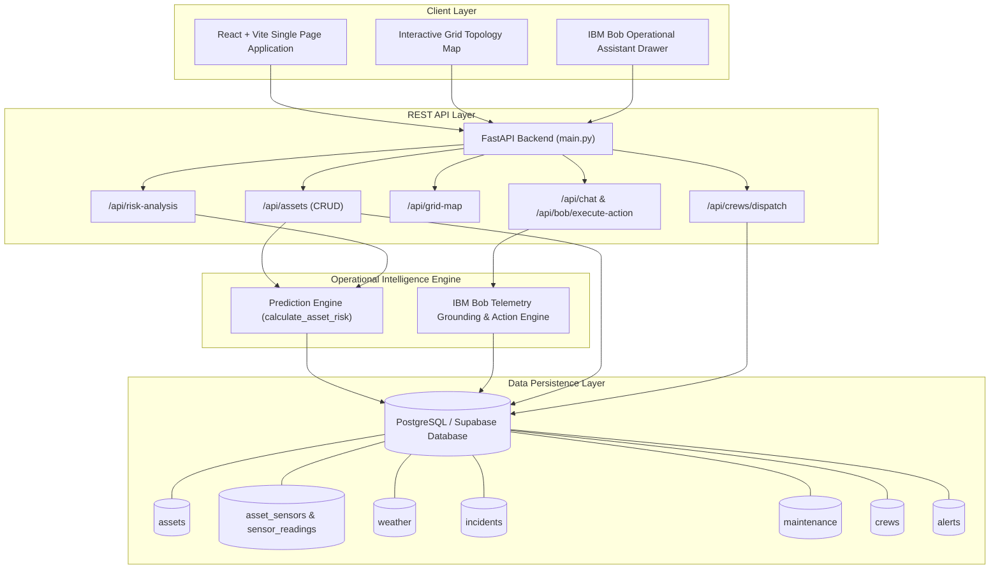
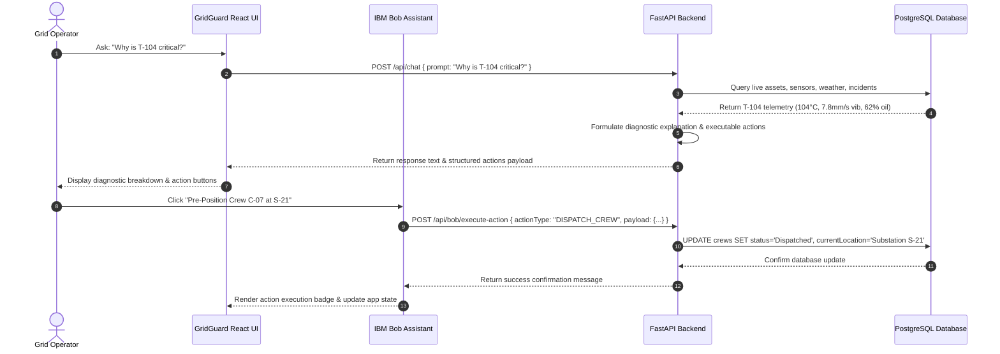

# Technical Architecture: GRIDGUARD AI Platform

## High-Level Architecture Diagram

## IBM Bob Assistant Action Execution Sequence

## Database Schema Model Design

- `assets`: Primary key `id` (e.g. `T-104`), name, type, category, substation, age, health score, failure probability, risk score, risk level, grid impact, thermal/vibration readings, prescribed action.
- `asset_sensors`: Foreign key to `assets.id`. Sensor type, value, threshold, status.
- `sensor_readings`: Historical time-series telemetry readings for sensors.
- `weather`: Meteorological conditions by zone/region, wind speed, lightning risk, risk multiplier.
- `incidents`: Outage/hazard incidents, severity, detected time, cause, assigned crew.
- `maintenance`: Work orders, priority, asset reference, recommended task, due date, status.
- `crews`: Available field repair crews, lead, skills, location, recommended position, ETA, status.
- `alerts`: Active system alarms, severity, message, action required.
- `outages`: Outage tracking records, affected customers, restoration ETA.
